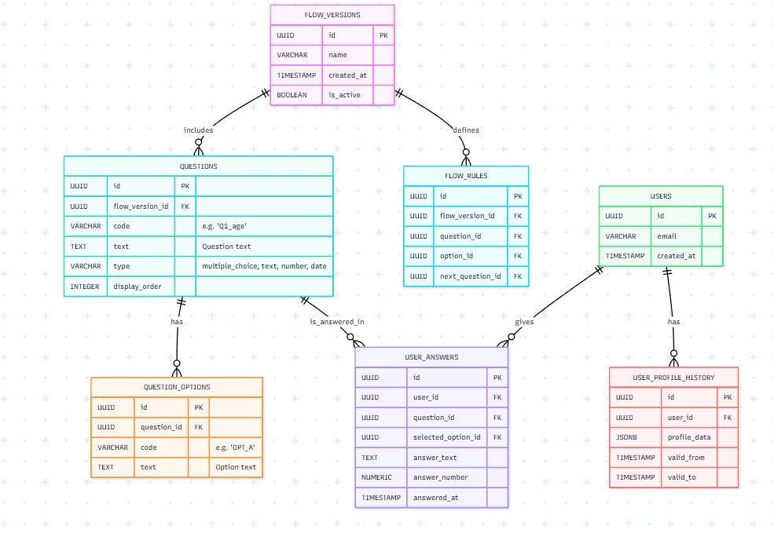
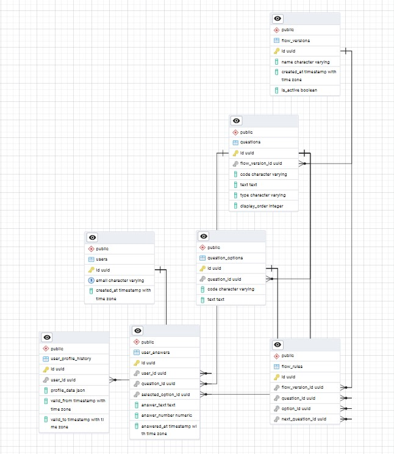
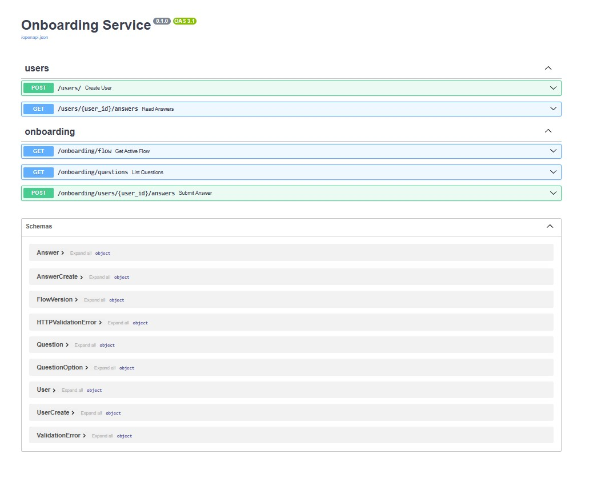

# 1. Schema Diagrams or Definitions



# 2. Schema Code

```sql
-- 2.1 Flow versioning & branching
CREATE TABLE flow_versions (
  id           UUID PRIMARY KEY DEFAULT gen_random_uuid(),
  name         VARCHAR NOT NULL,
  created_at   TIMESTAMP WITH TIME ZONE DEFAULT now(),
  is_active    BOOLEAN DEFAULT FALSE
);

CREATE TABLE questions (
  id             UUID PRIMARY KEY DEFAULT gen_random_uuid(),
  flow_version_id UUID NOT NULL REFERENCES flow_versions(id),
  code           VARCHAR NOT NULL,
  text           TEXT NOT NULL,
  type           VARCHAR NOT NULL CHECK (type IN ('multiple_choice','text','number','date')),
  display_order  INTEGER NOT NULL
);

CREATE TABLE question_options (
  id          UUID PRIMARY KEY DEFAULT gen_random_uuid(),
  question_id UUID NOT NULL REFERENCES questions(id),
  code        VARCHAR NOT NULL,
  text        TEXT NOT NULL
);

CREATE TABLE flow_rules (
  id               UUID PRIMARY KEY DEFAULT gen_random_uuid(),
  flow_version_id  UUID NOT NULL REFERENCES flow_versions(id),
  question_id      UUID NOT NULL REFERENCES questions(id),
  option_id        UUID NOT NULL REFERENCES question_options(id),
  next_question_id UUID NOT NULL REFERENCES questions(id)
);

-- 2.2 Users & answers
CREATE TABLE users (
  id          UUID PRIMARY KEY DEFAULT gen_random_uuid(),
  email       VARCHAR UNIQUE NOT NULL,
  created_at  TIMESTAMP WITH TIME ZONE DEFAULT now()
);

CREATE TABLE user_answers (
  id                 UUID PRIMARY KEY DEFAULT gen_random_uuid(),
  user_id            UUID NOT NULL REFERENCES users(id),
  question_id        UUID NOT NULL REFERENCES questions(id),
  selected_option_id UUID REFERENCES question_options(id),
  answer_text        TEXT,
  answer_number      NUMERIC,
  answered_at        TIMESTAMP WITH TIME ZONE DEFAULT now()
);

-- 2.3 Profile snapshots for history
CREATE TABLE user_profile_history (
  id           UUID PRIMARY KEY DEFAULT gen_random_uuid(),
  user_id      UUID NOT NULL REFERENCES users(id),
  profile_data JSONB NOT NULL,
  valid_from   TIMESTAMP WITH TIME ZONE DEFAULT now(),
  valid_to     TIMESTAMP WITH TIME ZONE
);
```

# 3. Design Explanation (200–300 words)

My design cleanly separates flow definitions from user data, enabling independent evolution:

- Evolving profile data

    user_answers stores each response in a type-safe way (option‐refs, text, number).

    user_profile_history snapshots the full profile as JSONB on each meaningful update, preserving an audit trail without altering table structure when new fields/questions are added.

- Changing onboarding questions

    Versioning via flow_versions lets us deploy new question sets in parallel.

    Every question, option, and branching rule is tied to a flow_version_id. We can “retire” old versions and mark a new one active, roll out A/B tests, or run multiple flows simultaneously without schema changes.

- Dynamic branching logic

    flow_rules encode “if answered <option_id> on <question_id>, go to <next_question_id>.”

    Because rules belong to a flow version, you can pivot branching behaviors simply by inserting/updating rows—no code redeploy needed.

This schema supports all requested question types via a discriminator column (type) and stores free‐text, numeric, or choice answers in the same table, keeping queries straightforward. Adding new question types or data fields requires no table migrations—just use JSONB in snapshots or add new columns to user_answers if needed. Historic flows and profiles remain queryable, offering full traceability of both how the onboarding changed over time and how each user’s profile evolved.


# Project Setup & Installation

> **A quick guide to set up your development environment and run the FastAPI application.**


## Prerequisites

Before you begin, ensure you have:

- **Python 3.11+** installed on your system.
- **pip** and the built-in **venv** module available.
- Access to a terminal (Command Prompt, PowerShell, or a Unix shell).

---

## 1. Create a Virtual Environment

```bash
# Navigate to the project root
cd /path/to/your/project

# Create a virtual environment named 'venv'
python -m venv venv


# Activate (macOS/Linux)
source venv/bin/activate
```

After activation, your prompt will display `(venv)`.

---

## 2. Install Dependencies

Install packages from `requirements.txt`:

```bash
pip install -r requirements.txt
```

Check for successful installation in the terminal output.


## 3. Start PostgreSQL & PGAdmin in containers:
docker compose up -d

🌐 If using PGAdmin (via Docker browser)
1. Go to http://localhost:5050
2. Login using the credentials from your .env file
3. Create a new server:
    Name: Name of your choice
    Host: my-postgres-container
    Port: 5432
    Database: postgres
    Username: postgres
    Password: postgres
    ✅ Save Password
4. Click Save — and you’re connected!



## 4. Run the Application

Start the FastAPI server python main.py
Access API Documentation:
- **Swagger UI**: [`/docs`](http://127.0.0.1:8000/docs)




